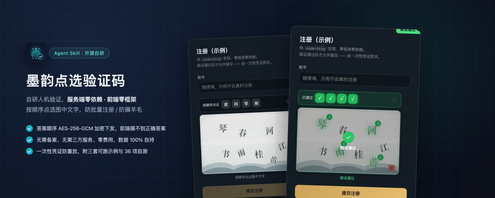

# 墨韵点选验证码 · zhiying-ink-captcha

> 自研点选式人机验证：答案顺序 AES-256-GCM 加密下发，服务端零依赖、前端零框架、无备案无费用，含三套可跑示例与 36 项自测。



`安全工具` `v1.0.0` `Agent Skills 标准` `MIT`

## 📥 安装

| 工具 | 方式 |
| --- | --- |
| **WorkBuddy** | 推荐市场搜索「墨韵点选验证码」一键安装，或把本目录复制到 `~/.workbuddy/skills/` |
| **Claude Code** | 把本目录复制到 `~/.claude/skills/`（项目级用 `.claude/skills/`） |
| **Codex CLI** | 把本目录复制到 `~/.agents/skills/` |
| **Cursor / Copilot / 其他** | 复制到对应 skills 目录，见[完整兼容列表](../../README.md#-兼容性其他-agent-工具也能用) |

## ✨ 为什么再造一个验证码轮子

现成方案在国内项目里都会撞上墙：reCAPTCHA 不可达、Turnstile 额度有限、商业验证收费且要备案、开源滑块**答案明文下发抓包即破**。

本方案的关键差异：**答案顺序用 AES-256-GCM 加密后下发，响应体只含字面与坐标**——抓包拿不到答案。

| 项 | 数值 |
| --- | --- |
| 第三方依赖 | **0 个**（不需要 `npm install`） |
| 数据库 | **不需要** |
| 要拷进项目的文件 | **4–5 个 / 57KB** |
| 服务器内存（5000 并发） | **0.10MB** |

## 📂 目录结构

```
SKILL.md                      技能指令正文
references/core-api.md        核心 API 速查
payload/ink-captcha/          完整源码（可直接拷进用户项目）
├── src/                      核心代码：服务端核心 / 底图生成 / 限流 / 前端组件 / React 封装
├── examples/                 三套可运行示例：node-http（零框架）/ Express / Next.js
├── scripts/                  selftest.mjs（36 项自测）/ verify-install.mjs（装后自检）
├── docs/                     接入指南 / 安全说明 / FAQ
└── start.sh                  一条命令跑起来
```

## 🚀 快速验证

```bash
cd payload/ink-captcha
bash start.sh                 # 起示例并探活
```

浏览器打开 `http://localhost:3737` 即可真实点选。需要 Node ≥ 18。

## ✅ 装完怎么确认真的生效

**别看接口返回 200 就以为好了。** 必须走完三步：

1. 页面上真能看到底图（不是白块），点字有反馈
2. 按提示点对 4 个字 → 提交 → 业务真的成功
3. **同一个凭证再提交一次 → 必须失败**（重放防护生效）

第 3 条是判断「有没有真装上」的关键。若第 3 次还能成功，说明 `consumePassToken` 没接上，防护是假的。

## ⚠️ 三个必须知道的限制

1. **必须有 Node 服务端** —— 校验密钥要保密，纯静态站做不到（包内有替代方案说明）
2. **多实例部署时密钥必须一致** —— 否则用户会随机失败
3. **不防打码平台和真人众包** —— 详见 `payload/ink-captcha/docs/安全说明.md`，别过度承诺

## 📄 内容

技能指令正文见 [SKILL.md](SKILL.md)。

---

**作者：宫帅（AI智库 · 智影科技）** · [智影技能库](https://github.com/zhiyingstudio/zhiying-skills) · [AI智库官网](https://ai-zhiku.com) · MIT License
