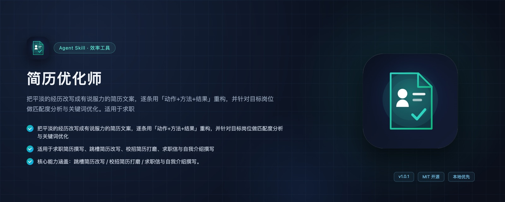

# 简历优化师 · zhiying-resume-optimizer

> 把平淡经历改写成有说服力的简历文案：逐条重构、匹配岗位、优化关键词与自我介绍。

`效率工具` `v1.0.1` `Agent Skills 标准` `MIT`

## 📥 安装

| 工具 | 方式 |
| --- | --- |
| **WorkBuddy** | 推荐市场搜索「简历优化师」一键安装，或把本目录复制到 `~/.workbuddy/skills/` |
| **Claude Code** | 把本目录复制到 `~/.claude/skills/`（项目级用 `.claude/skills/`） |
| **Codex CLI** | 把本目录复制到 `~/.agents/skills/` |
| **Cursor / Copilot / 其他** | 复制到对应 skills 目录，见[完整兼容列表](../../README.md#-兼容性其他-agent-工具也能用) |

## 📄 内容

技能指令正文见 [SKILL.md](SKILL.md)。附带资源目录：`references/`。

---

**作者：宫帅（AI智库 · 智影科技）** · [智影技能库](https://github.com/zhiyingstudio/zhiying-skills) · [AI智库官网](https://ai-zhiku.com) · MIT License
